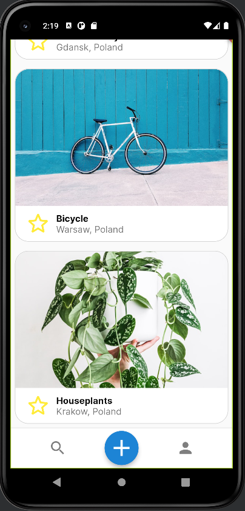
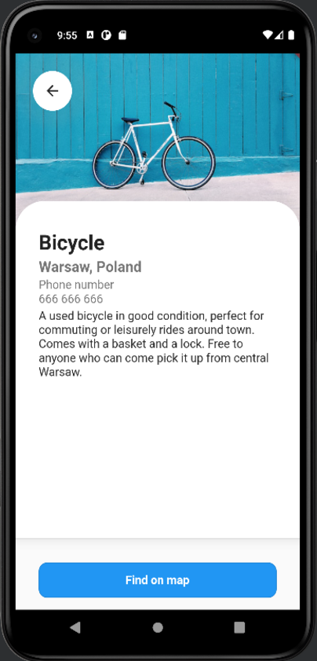
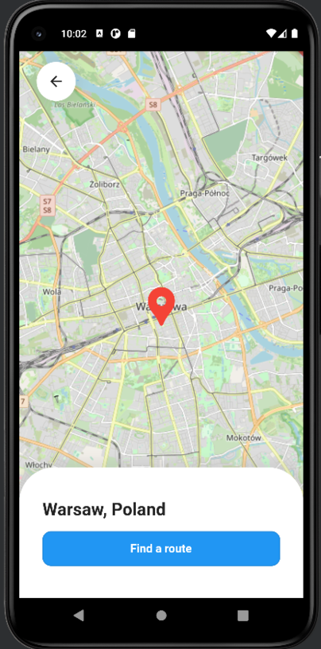

# GiveAway
Market place mobile app written in Flutter for my Mobile Application Development class where you can give away items for free to people in your area. 

The app allows users to browse items and check where they are located on the map and find the best route to get there. To access the site the users can login with their Google account or create a new account.

The maps and routes are fetched from [Openstreetmap](https://www.openstreetmap.org) and [Openrouteservice](https://openrouteservice.org/) APIs.

# Main page and item detail page

# Map view

## Technologies
* Flutter
* ASP .Net Core WebApi 7.0
* C#

## Todo:
- [x] Add user authentication and authorization 
- [ ] Add google authentication
- [x] Add maps to show where the items are located
- [ ] Add ability to find a route by a given geographical location 
- [ ] Add dark mode
- [x] Add main page with list of items
- [x] Add item detail page
