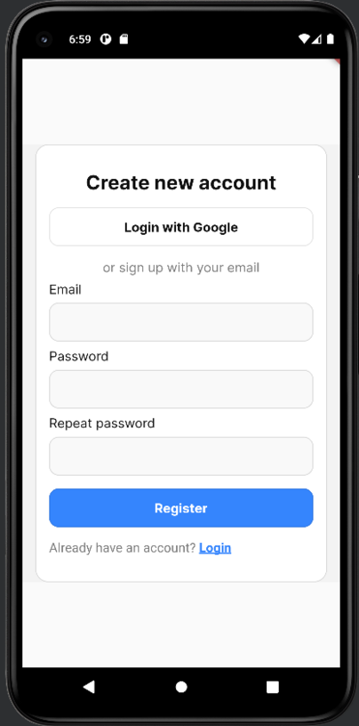

# GiveAway
Market place mobile app written in Flutter for my Mobile Application Development class where you can give away items for free to people in your area. 

The app allows users to browse items and check where they are located on the map and find the best route to get there based on their geographical location. To access the site the users can login with their Google account or create a new account.

The maps and routes are fetched from [Openstreetmap](https://www.openstreetmap.org) and [Openrouteservice](https://openrouteservice.org/) APIs.

## Technologies
* Flutter
* ASP .Net Core WebApi 7.0
* C#

# Main view and item detail view

# Map view
 
# Register view

